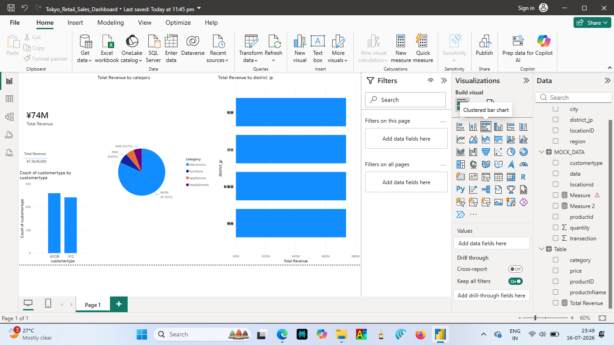

# Tokyo Retail Sales Dashboard

A localized business intelligence project modeling 500 retail transactions across major Tokyo districts using a relational Star Schema database architecture. 

## 📊 Dashboard Preview

## 🛠️ Project Highlights
- *Data Modeling:* Constructed a Star Schema linking transaction data with specialized Product and Location dimensions.
- *Localization:* Integrated Japanese business terminology (会社員, 学生, 新宿, 渋谷, 秋葉原, 銀座) aligned with my JLPT N5 language studies.
- *DAX Calculations:* Formatted core financial metrics natively in Japanese Yen (¥) with zero decimal precision.
